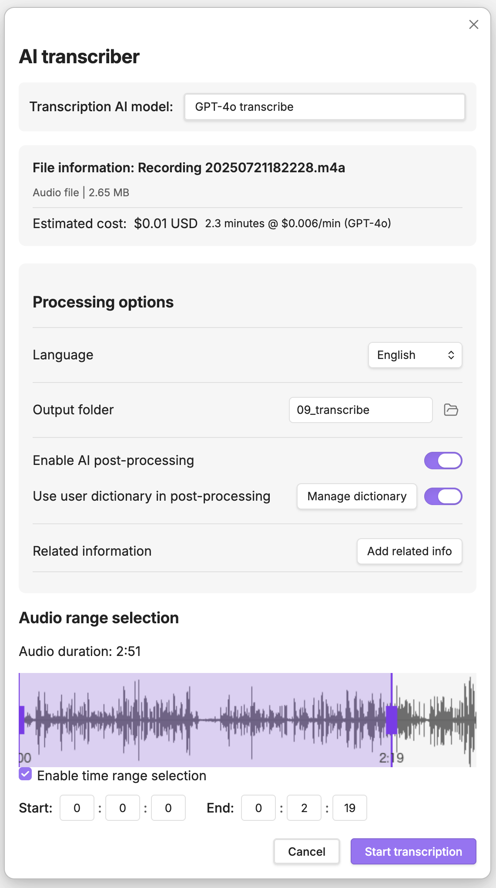
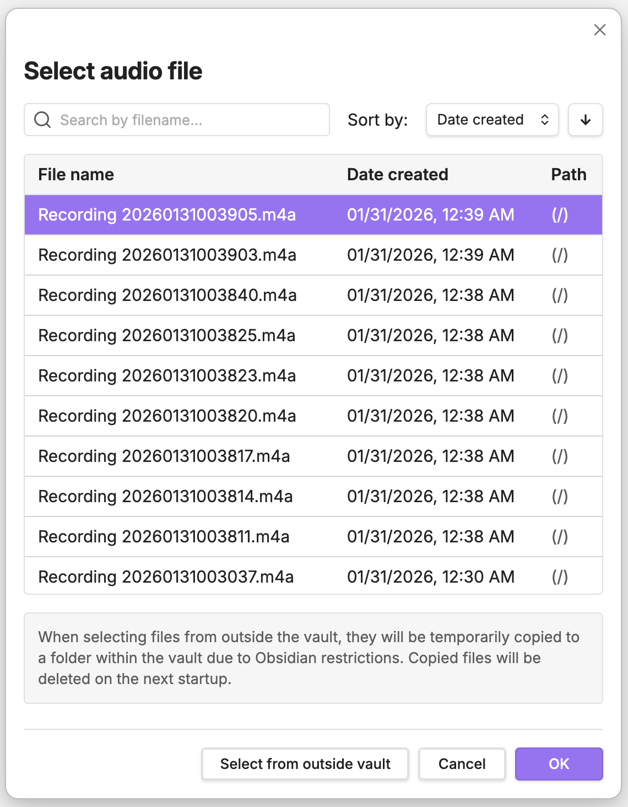
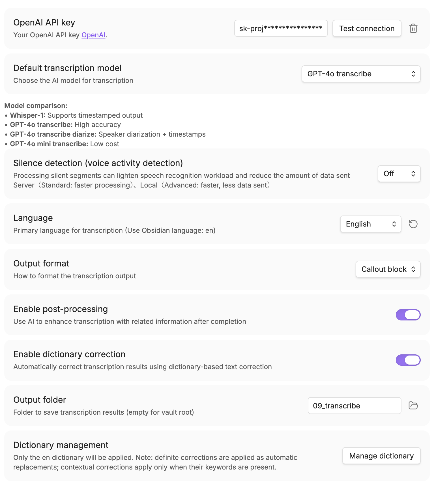

# AI Transcriber

A powerful speech-to-text transcription plugin for Obsidian that uses OpenAI's GPT-4o Transcribe / GPT-4o Mini Transcribe and Whisper APIs.

## Features

- **File Transcription**: Transcribe existing audio and video files (see supported formats below)
- **Post-Processing**: Optional word correction to improve transcription accuracy
- **Multi-Language**: Supports multiple languages with automatic detection

## Screenshots

## Supported file formats

Supported extensions:
- **Audio**: `mp3`, `m4a`, `wav`, `flac`, `ogg`, `aac`
- **Video**: `mp4`, `m4v`, `mov`, `avi`, `mkv`, `webm`

Notes:
- Video files are processed by extracting the audio track. Support depends on the file codec/DRM and your environment; if it fails, convert to an audio format (e.g., `m4a`, `wav`, `mp3`).
- The external file picker currently supports up to **500MB** per file. Files already in your vault have no explicit size limit, but very large files may take longer and use more memory, which can affect performance; consider splitting if needed.

## Requirements

- Obsidian v1.8.0 or higher (Desktop only)
- OpenAI API account with API key
- Internet connection for API calls

## Installation

### From Obsidian Community Plugins

1. Open Obsidian Settings
2. Navigate to "Community plugins"
3. Click "Browse" and search for "AI Transcriber"
4. Click "Install"
5. Enable the plugin

### Manual Installation

1. Download the latest release from the [GitHub releases page](https://github.com/mssoftjp/obsidian-ai-transcriber/releases)
2. Extract the files to your vault's plugins folder: `<vault>/.obsidian/plugins/ai-transcriber/`
3. Reload Obsidian
4. Enable the plugin in Settings → Community plugins

## Setup

### Getting an OpenAI API Key

1. Visit [OpenAI Platform](https://platform.openai.com/)
2. Sign up or log in to your account
3. Navigate to API keys section
4. Create a new API key
5. Copy the key (you won't be able to see it again!)

**Important**: OpenAI API is a paid service. You will be charged based on usage. Please check [OpenAI's pricing page](https://openai.com/api/pricing) for current rates.

### Configuring the Plugin

1. Open Obsidian Settings → AI Transcriber
2. Enter your OpenAI API key
3. Choose your preferred transcription model:
   - **GPT-4o Transcribe** (`gpt-4o-transcribe`): Highest quality transcription (recommended)
   - **GPT-4o Mini Transcribe** (`gpt-4o-mini-transcribe`): Fast and cost-effective
   - **Whisper** (`whisper-1`): Traditional transcription model

#### Optional: Local VAD (fvad.wasm)

By default, the plugin uses server-side VAD. If you prefer local VAD (WebRTC VAD) for on-device speech/silence detection:

1. Download `fvad.wasm` from the echogarden project: https://github.com/echogarden-project/fvad-wasm
2. In the plugin settings, select "Local" from the VAD Mode dropdown and load the file using the file loader (alternatively, place the file at: `<vault>/.obsidian/plugins/ai-transcriber/fvad.wasm`)
3. Set VAD Mode to "Local" in the plugin settings

If `fvad.wasm` is not present, the plugin automatically falls back to server-side VAD (or no VAD depending on your settings).

## Usage

### Transcribing Audio/Video Files

1. Use the command palette: "AI Transcriber: Transcribe audio file"
2. Select an audio or video file from your device
3. Choose transcription settings
4. Wait for processing
5. The transcription text will be saved to your specified folder

## Settings

### API Settings
- **API Key**: Your OpenAI API key (stored securely)
- **Model Selection**: Choose between GPT-4o Transcribe (`gpt-4o-transcribe`), GPT-4o Mini Transcribe (`gpt-4o-mini-transcribe`), and Whisper (`whisper-1`)
- **Language**: Specify a language (settings serve as a baseline, but the API will detect as appropriate)

### Output Settings
- **Save Location**: Folder for transcribed notes
- **Post-Processing**: Enable/disable transcript enhancement

### Dictionary Settings
- **Custom Dictionary**: Improve transcription accuracy with personalized corrections
  - Register commonly mistranscribed words or proper nouns
  - Support for multiple languages (Japanese, English, Chinese, Korean)

## Network Usage Disclosure

This plugin requires an internet connection and communicates with the following services:

- **OpenAI API** (api.openai.com): Used for audio transcription and text processing
  - Audio data is sent to OpenAI for transcription
  - API key is sent with each request for authentication
  - No data is stored permanently by the plugin beyond the transcribed text

## Privacy and Security

- Your OpenAI API key is stored securely using Obsidian's built-in encryption
- Audio recordings are processed locally before being sent to OpenAI
- No telemetry or usage data is collected by this plugin
- Transcribed text is saved only to your local vault

## Troubleshooting

### Common Issues

**"Invalid API Key" error**
- Verify your API key is correct and active
- Check if you have sufficient credits in your OpenAI account

**"Recording failed" error**
- Ensure your computer has microphone permissions
- Try using a different audio format in settings

**Transcription is cut off or incomplete**
- Large audio files may hit token limits
- Try using shorter recordings or split long files

**Poor transcription quality**
- Ensure good audio quality (minimal background noise)
- Speak clearly and at a moderate pace
- Try using GPT-4o Transcribe model for better accuracy

### Getting Help

If you encounter issues:
1. Check the console for error messages (Ctrl/Cmd + Shift + I)
2. Disable other plugins to test for conflicts
3. Report issues on [GitHub](https://github.com/mssoftjp/obsidian-ai-transcriber/issues)

## Support

If you find this plugin helpful, consider:
- Starring the repository on [GitHub](https://github.com/mssoftjp/obsidian-ai-transcriber)
- Reporting bugs or suggesting features
- Contributing to documentation

## License

This plugin is licensed under the MIT License. See [LICENSE](LICENSE) for details.

### Third-Party Software

This plugin includes third-party software with their own licenses. See [THIRD-PARTY-LICENSES.md](THIRD-PARTY-LICENSES.md) for details.

Notable third-party components:
- **WebRTC VAD (@echogarden/fvad-wasm)**: Used for voice activity detection

## Acknowledgments

- The wonderful Obsidian team for providing an excellent platform
- OpenAI for providing powerful AI models

### Open Source Libraries

- **WebRTC VAD** - Google's voice activity detection algorithm
- **@echogarden/fvad-wasm** - WASM port of WebRTC VAD
- **@noble/hashes** - Cryptographic hash functions by Paul Miller

### Development Tools

- **Node.js** - JavaScript runtime
- **TypeScript** - Type-safe JavaScript
- **esbuild** - Fast JavaScript bundler
- **Jest** - Testing framework

---

# AI Transcriber

OpenAIのGPT-4o Transcribe / GPT-4o Mini TranscribeとWhisper APIを使用したObsidian用の強力な音声認識テキスト変換プラグインです。

## 機能

- **ファイル文字起こし**: 音声ファイル・動画ファイルを文字起こし（対応形式は下記）
- **後処理**: 文字起こし精度を向上させるオプションの単語校正機能
- **多言語対応**: 自動検出による複数言語のサポート

## スクリーンショット

## 対応ファイル形式

対応している拡張子:
- **音声**: `mp3`, `m4a`, `wav`, `flac`, `ogg`, `aac`
- **動画**: `mp4`, `m4v`, `mov`, `avi`, `mkv`, `webm`

補足:
- 動画ファイルは音声トラックを抽出して処理します。コーデック/DRMや環境によっては失敗する場合があるため、その場合は音声形式（例: `m4a`, `wav`, `mp3`）に変換してお試しください。
- Vault外から選択するファイルは現状 **最大500MB** までです。Vault内のファイルには明示的な上限は設けていませんが、大きいファイルは処理に時間がかかったり、メモリ使用量が増えて動作が重くなることがあります。必要に応じて分割してお試しください。

## 必要条件

- Obsidian v1.8.0以上（デスクトップ版のみ）
- OpenAI APIキー
- API呼び出し用のインターネット接続

## インストール

### Obsidian Community Pluginsから

1. Obsidianの設定を開く
2. 「Community plugins」に移動
3. 「閲覧」をクリックして「AI Transcriber」を検索
4. 「インストール」をクリック
5. プラグインを有効化

### 手動インストール

1. [GitHubリリースページ](https://github.com/mssoftjp/obsidian-ai-transcriber/releases)から最新リリースをダウンロード
2. ファイルをvaultのプラグインフォルダに展開: `<vault>/.obsidian/plugins/ai-transcriber/`
3. Obsidianを再読み込み
4. 設定 → Community pluginsでプラグインを有効化

## セットアップ

### OpenAI APIキーの取得

1. [OpenAI Platform](https://platform.openai.com/)にアクセス
2. アカウントにサインアップまたはログイン
3. APIキーセクションに移動
4. 新しいAPIキーを作成
5. キーをコピー（再度表示されません！）

**重要**: OpenAI APIは有料サービスです。使用量に基づいて課金されます。現在の料金は[OpenAIの価格ページ](https://openai.com/api/pricing)をご確認ください。

### プラグインの設定

1. Obsidian設定 → AI Transcriberを開く
2. OpenAI APIキーを入力
3. 希望の文字起こしモデルを選択:
   - **GPT-4o Transcribe** (`gpt-4o-transcribe`): 最高品質の文字起こし（推奨）
   - **GPT-4o Mini Transcribe** (`gpt-4o-mini-transcribe`): 高速でコスト効率が良い
   - **Whisper** (`whisper-1`): 従来の文字起こしモデル

#### ローカルVAD（任意 / fvad.wasm）

既定ではサーバーサイドVADを使用します。端末内で音声/無音判定（WebRTC VAD）を行いたい場合は以下の手順でローカルVADを有効化できます。

1. echogardenプロジェクトから `fvad.wasm` をダウンロード: https://github.com/echogarden-project/fvad-wasm
2. 設定の無音検出方式のプルダウンでローカルを選択し、ファイルの読み込みでfvad.wasmを導入（もしくは次の場所に配置: `<vault>/.obsidian/plugins/ai-transcriber/fvad.wasm`）
3. プラグイン設定で VAD モードを「ローカル」に設定

## 使用方法

### 音声/動画ファイルの文字起こし

1. コマンドパレット: 「AI Transcriber: 音声ファイルを文字起こし」を使用
2. デバイスから音声/動画ファイルを選択
3. 文字起こし設定を選択
4. 処理を待つ
5. 文字起こしテキストが指定されたフォルダに保存されます

## 設定

### API設定
- **APIキー**: OpenAI APIキー（安全に保存）
- **モデル選択**: GPT-4o Transcribe（`gpt-4o-transcribe`）、GPT-4o Mini Transcribe（`gpt-4o-mini-transcribe`）、Whisper（`whisper-1`）から選択
- **言語**: 言語を指定（設定を基本としつつもAPI側で適宜判別）

### 出力設定
- **保存場所**: 文字起こしノートのフォルダ
- **後処理**: transcript強化の有効/無効

### 辞書設定
- **カスタム辞書**: 個人用の補正辞書で文字起こし精度を向上
  - よく誤認識される単語や固有名詞を登録
  - 複数言語対応（日本語、英語、中国語、韓国語）

## ネットワーク使用の開示

このプラグインはインターネット接続が必要で、以下のサービスと通信します：

- **OpenAI API** (api.openai.com): 音声の文字起こしとテキスト処理に使用
  - 音声データは文字起こしのためOpenAIに送信されます
  - APIキーは認証のため各リクエストと共に送信されます
  - プラグインによって文字起こしされたテキスト以外のデータは永続的に保存されません

## プライバシーとセキュリティ

- OpenAI APIキーはObsidianの組み込み暗号化を使用して安全に保存されます
- 音声録音はOpenAIに送信される前にローカルで処理されます
- このプラグインによるテレメトリーや使用データの収集はありません
- 文字起こしされたテキストはローカルのvaultにのみ保存されます

## トラブルシューティング

### よくある問題

**「無効なAPIキー」エラー**
- APIキーが正しく、アクティブであることを確認
- OpenAIアカウントに十分なクレジットがあるか確認

**「録音に失敗しました」エラー**
- PCにマイクの権限があることを確認
- 設定で別の音声形式を試す

**文字起こしが途切れるまたは不完全**
- 大きな音声ファイルはトークン制限に達する可能性があります
- より短い録音を使用するか、長いファイルを分割してください

**文字起こし品質が悪い**
- 良好な音質を確保（背景ノイズを最小限に）
- はっきりと、適度なペースで話す
- より高い精度のためGPT-4o Transcribeモデルを試す

### ヘルプを得る

問題が発生した場合：
1. エラーメッセージのコンソールを確認（Ctrl/Cmd + Shift + I）
2. 競合をテストするため他のプラグインを無効化
3. [GitHub](https://github.com/mssoftjp/obsidian-ai-transcriber/issues)で問題を報告

## サポート

このプラグインが役立つと思われた場合：
- [GitHub](https://github.com/mssoftjp/obsidian-ai-transcriber)でリポジトリにスターを付ける
- バグの報告や機能の提案
- ドキュメントへの貢献

## ライセンス

このプラグインはMITライセンスの下でライセンスされています。詳細は[LICENSE](LICENSE)をご覧ください。

### サードパーティソフトウェア

このプラグインには独自のライセンスを持つサードパーティソフトウェアが含まれています。詳細は[THIRD-PARTY-LICENSES.md](THIRD-PARTY-LICENSES.md)をご覧ください。

主なサードパーティコンポーネント：
- **WebRTC VAD (@echogarden/fvad-wasm)**: - 音声区間検出に使用

## 謝辞

- 素晴らしいプラットフォームを提供してくれたObsidianチーム
- 強力なAIモデルを提供してくれたOpenAI

### オープンソースライブラリ

- **WebRTC VAD** - Googleの音声区間検出アルゴリズム
- **@echogarden/fvad-wasm** - WebRTC VADのWASMポート
- **@noble/hashes** - Paul Miller氏による暗号化ハッシュ関数

### 開発ツール

- **Node.js** - JavaScriptランタイム
- **TypeScript** - 型安全なJavaScript
- **esbuild** - 高速JavaScriptバンドラー
- **Jest** - テスティングフレームワーク
